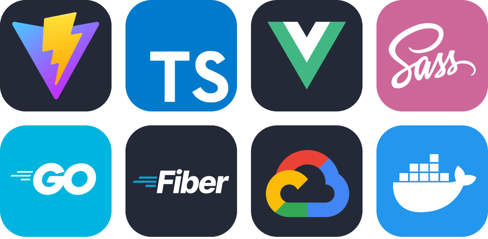

<p align="center">

</p>
 
# Go Writable 📒

Welcome to my versatile notes application, inspired by the intuitive design of Notion! Crafted with the robustness of Golang, our backend is powered by go-fiber and gorm, ensuring seamless data handling. On the frontend, we've embraced the agility of Vue.js and the swiftness of Vite, delivering a dynamic and efficient user experience. Dive into a world where simplicity meets functionality, enabling you to organize your thoughts effortlessly.

> [!NOTE] 
> This application is solely created for educational purposes and will not be developed into a fully-fledged product. While you're welcome to explore its functionalities, please be aware that it's intended for learning and experimentation rather than practical use

<h3 align="center">
<a href="https://go-writable.vercel.app/">
< Website >
</a>
</h3>

## Run With Air 🌬️

To run the backend in development mode you are gonna need to install the go language and the air tool for hot reloading. To find tutorial on how to download the tools you can go the following liks -> [Go-lang](https://go.dev/doc/install) & [air]()

The command used to run with is:

```bash
> air
```

## Run With Docker 🐋

```bash
> docker build -t go-writable .
> docker run -p 3000:3000 go-writable
```

## Todo ✅

- [ ] Use swagger on dev mode
- [x] Create simple front end
- [x] Create custom error response
- [x] Add delete route
- [x] Deploy backend
- [ ] Create condition on create document(max: 10 documentos)


### Tools 🛠

<p align="center">

</p>

## Entre em contato 📞

<br>

<p align="center">
<a href="https://www.linkedin.com/in/luis-felipe-vanin-martins-5a5b38215">

</a>
<a href="mailto:luisfvanin2@gmail.com">

</a>
 
